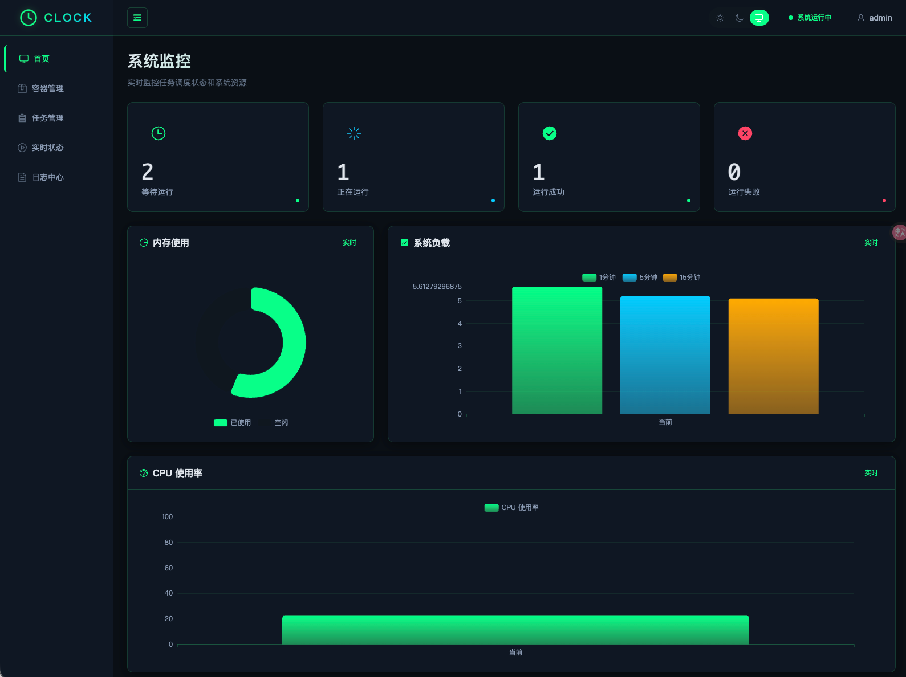
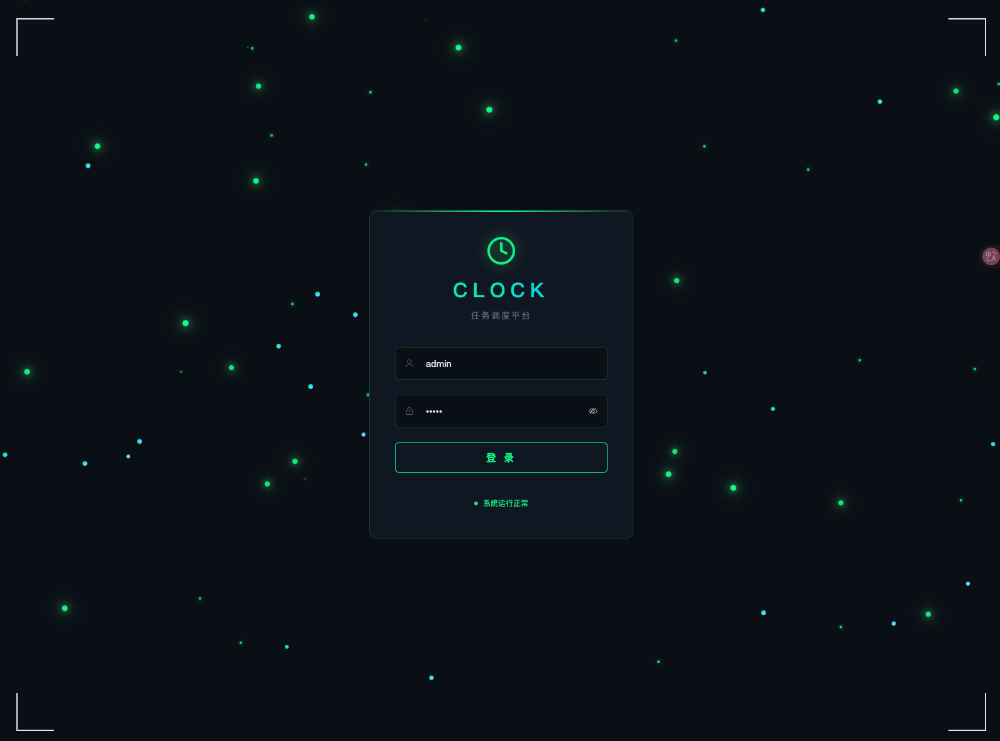
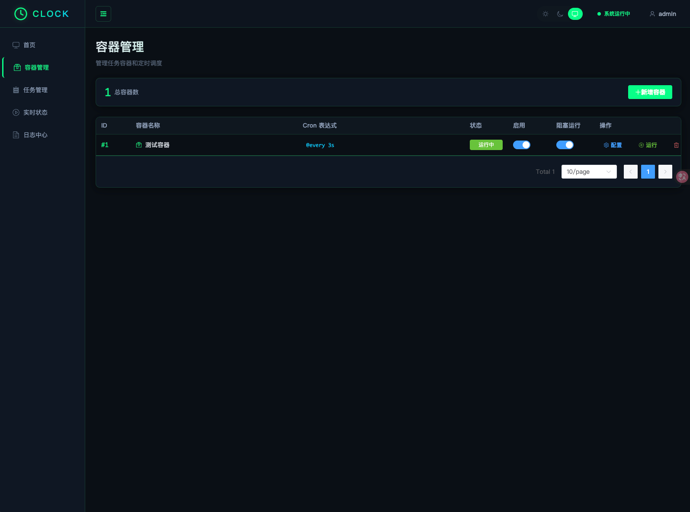
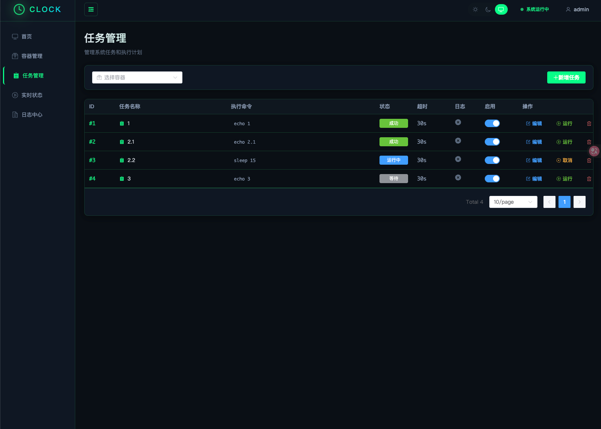
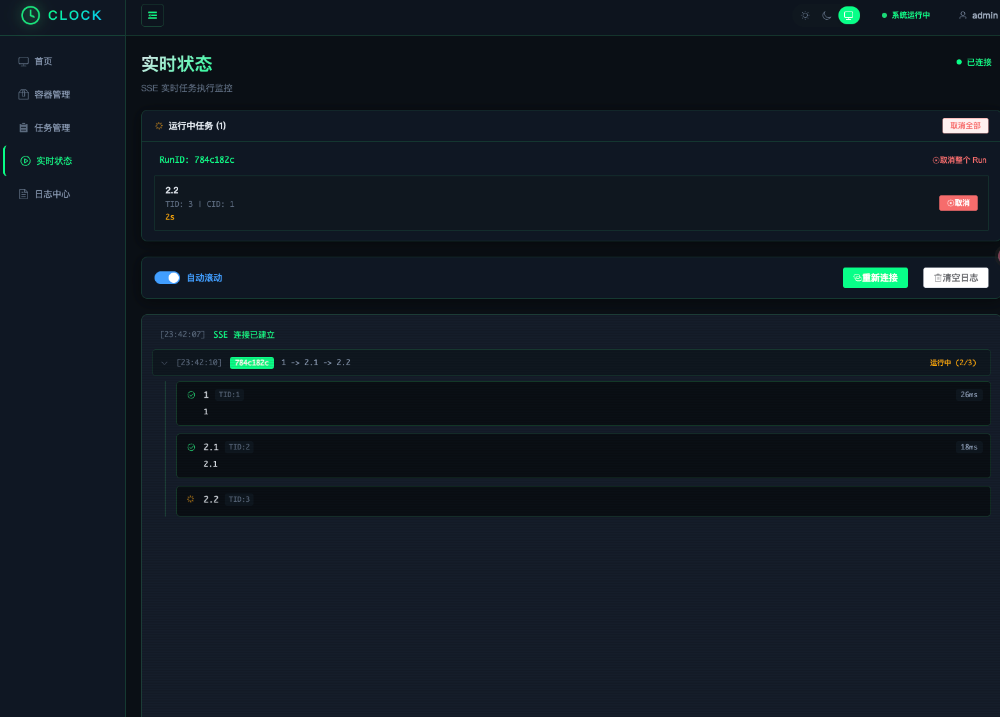
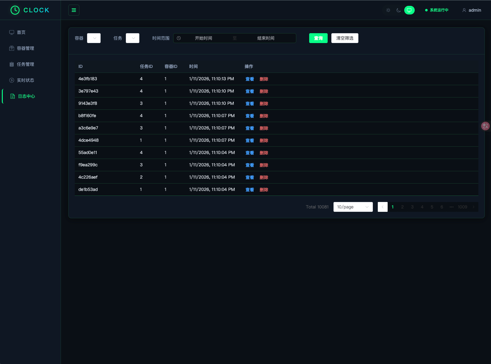

<div align=center>

</div>

# Clock - 任务调度平台

基于 Go cron 的可视化调度框架，支持 DAG 任务依赖关系和 Bash 命令执行。前后端通过 `go:embed` 打包成单个二进制文件，轻松部署。

## 功能特性

- **DAG 任务依赖管理** - 可视化编辑任务之间的依赖关系，支持拓扑排序执行
- **定时调度** - 基于 cron 表达式的定时任务调度
- **任务取消** - 支持取消单个任务或整个调度批次，正在执行的命令会被终止
- **阻塞运行** - 容器级别配置，上次调度未完成时自动跳过本次，防止任务堆积
- **实时状态监控** - SSE (Server-Sent Events) 实时推送任务执行状态
- **日志管理** - 实时日志流式查看，历史日志持久化查询
- **系统监控** - 内存、CPU、系统负载实时监控
- **多主题支持** - 亮色、暗色、荧光多种主题切换
- **JWT 认证** - 安全的身份验证机制
- **单文件部署** - 前后端打包成一个二进制文件

## 技术栈

### 后端
- Go 1.24+
- [Echo](https://echo.labstack.com) - 高性能 Web 框架
- [GORM](https://gorm.io) - ORM 数据库访问
- [robfig/cron](https://github.com/robfig/cron) - 定时调度器
- [go:embed](https://pkg.go.dev/embed) - 静态文件打包

### 前端
- Vue 3 + TypeScript
- Element Plus - UI 组件库
- AntV G6 - DAG 图可视化
- ECharts - 图表展示
- Pinia - 状态管理
- Vue Router - 路由管理

## 项目结构

```
clock/
├── cmd/
│   └── clock/
│       └── main.go           # 程序入口
├── configs/
│   └── config.toml           # 配置文件
├── internal/
│   ├── config/               # 配置解析
│   ├── domain/               # 领域模型
│   │   ├── container.go      # 容器模型
│   │   ├── task.go           # 任务模型
│   │   ├── relation.go       # DAG 关系模型
│   │   ├── tasklog.go        # 日志模型
│   │   └── message.go        # 消息模型
│   ├── handler/              # HTTP 处理器
│   │   ├── task_handler.go
│   │   ├── container_handler.go
│   │   ├── log_handler.go
│   │   ├── relation_handler.go
│   │   ├── auth_handler.go
│   │   └── message_handler.go
│   ├── middleware/           # 中间件
│   │   ├── jwt.go            # JWT 认证
│   │   └── logger.go         # 请求日志
│   ├── repository/           # 数据访问层
│   │   ├── container_repo.go
│   │   ├── task_repo.go
│   │   ├── relation_repo.go
│   │   └── tasklog_repo.go
│   ├── router/               # 路由注册
│   ├── service/              # 业务逻辑
│   │   ├── scheduler_service.go  # 调度服务
│   │   ├── executor.go           # 执行器
│   │   ├── stream_hub.go         # SSE 广播
│   │   └── message_service.go
│   └── runner/               # 任务执行器
├── web/
│   └── dist/                 # 前端构建产物 (嵌入式)
├── server/webapp/            # 前端源码
│   ├── src/
│   │   ├── views/            # 页面组件
│   │   ├── api/              # API 客户端
│   │   ├── stores/           # Pinia 状态
│   │   └── router/           # 前端路由
│   └── vite.config.ts
└── docs/
    └── images/               # 文档截图
```

## 快速开始

### 1. 前端开发

```bash
cd server/webapp

# 安装依赖
npm install

# 开发模式 (需要同时启动后端)
npm run dev

# 构建生产版本
npm run build
```

### 2. 后端运行

```bash
# 运行开发版本
go run cmd/clock/main.go -c configs/config.toml

# 构建生产版本
CGO_ENABLED=0 GOOS=linux GOARCH=amd64 go build -o clock cmd/clock/main.go

# 运行
./clock -c configs/config.toml
```

### 3. 访问系统

打开浏览器访问 http://127.0.0.1:9528

默认用户名：`admin`
默认密码：`admin`

## 使用流程

### 1. 登录系统



### 2. 创建容器

容器是任务组，用于管理一组相关任务的调度。



- 点击「新增容器」
- 填写容器名称和 cron 表达式
- 配置阻塞运行选项（启用后，上次调度未完成则跳过本次）
- 启用容器

### 3. 添加任务

任务是具体的 bash 命令执行单元。



- 选择容器
- 点击「新增任务」
- 填写任务名称和执行命令
- 设置超时时间和日志选项

### 4. 配置 DAG 依赖

通过可视化界面配置任务之间的依赖关系，确保任务按正确顺序执行。


### 5. 实时监控



- 查看任务实时执行状态
- SSE 推送日志输出
- 自动滚动和手动控制
- 支持取消单个任务或整个调度批次

### 6. 日志查询



- 按容器、任务筛选
- 时间范围查询
- 查看历史执行记录

## 核心架构

### DAG 执行原理

使用 Kahn 算法实现拓扑排序：
1. 计算所有任务的入度
2. 选择入度为 0 的任务并行执行
3. 任务完成后减少其依赖任务的入度
4. 重复直到所有任务完成

### 任务取消机制

支持两种级别的取消操作：
- **取消单个任务** - 终止指定任务的执行进程，后续依赖任务不再执行
- **取消整个批次** - 终止该 RunID 下所有正在执行的任务，并阻止后续任务启动

### 阻塞运行模式

容器级别的并发控制：
- **启用阻塞** - 同一容器在上次调度未完成时，跳过本次调度，防止任务堆积
- **关闭阻塞** - 允许多个调度批次并发执行

### SSE 实时推送

```
┌─────────────┐     SSE      ┌─────────────┐
│   Executor  │ ──────────► │ StreamHub   │
│  (执行任务)  │             │  (广播中心)  │
└─────────────┘             └──────┬──────┘
                                   │
                            ┌──────▼──────┐
                            │   客户端    │
                            │ (浏览器)    │
                            └─────────────┘
```

### JWT 认证

Token 支持三种传递方式：
1. Header: `Authorization: Bearer <token>`
2. Cookie
3. Query: `?token=<token>`

## 配置文件

```toml
[server]
host = "0.0.0.0"
port = 9528

[storage]
type = "sqlite"  # sqlite, mysql, postgresql
dsn = "clock.db"

[auth]
secret = "your-secret-key"
expire = 24  # 小时

[message]
expire = 24  # 小时
```

## 数据库支持

支持 SQLite、MySQL、PostgreSQL，通过配置文件切换。

## License

MIT
